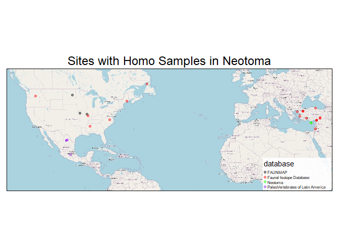

<style type="text/css">
p {
  font-size:18px;
}

ul {
  font-size:18px;
}

li {
  font-size:18px;
}
table {
   padding: 0;border-collapse: collapse;
   layout: fixed;
   width: 90%; }
table tr {
   border-top: 1px solid #cccccc;
   background-color: white;
   margin: 0;
   padding: 0; }
table tr:nth-child(2n) {
   background-color: #f8f8f8; }
table tr th {
   font-weight: bold;
   border: 1px solid #cccccc;
   margin: 0;
   padding: 6px 13px; }
table tr td {
   border: 1px solid #cccccc;
   margin: 0;
   padding: 6px 13px; }
table tr th :first-child, table tr td :first-child {
   margin-top: 0; }
table tr th :last-child, table tr td :last-child {
   margin-bottom: 0; }
.html-widget {
    margin: auto;
}
</style>

---

This document shows what records of Homo sapiens I was able to find in Neotoma. My method was first to download the whole taxa table and find the taxon id for any relevant sounding taxa. The first table below shows the taxa I found.


```{=html}
<div class="datatables html-widget html-fill-item" id="htmlwidget-3bbc2600d2576b8cdaf8" style="width:100%;height:auto;"></div>
<script type="application/json" data-for="htmlwidget-3bbc2600d2576b8cdaf8">{"x":{"filter":"none","vertical":false,"data":[["6116","7196","6821","6822"],["Homo sapiens","cf. Homo sapiens","Homo","Hominidae"],["6821","6171","6822","6359"],["FALSE","TRUE","FALSE","FALSE"]],"container":"<table class=\"display\">\n  <thead>\n    <tr>\n      <th>taxonid<\/th>\n      <th>taxonname<\/th>\n      <th>highertaxonid<\/th>\n      <th>extinct<\/th>\n    <\/tr>\n  <\/thead>\n<\/table>","options":{"columnDefs":[{"name":"taxonid","targets":0},{"name":"taxonname","targets":1},{"name":"highertaxonid","targets":2},{"name":"extinct","targets":3}],"order":[],"autoWidth":false,"orderClasses":false}},"evals":[],"jsHooks":[]}</script>
```

(FYI, taxonid 6359 is Primates, and 6171 is Mammalia)

Then I searched for all occurrences of any of those taxa. 

The two maps below (one static, one dynamic) shows the sites they come from, and the table below that shows the sample information on those 28 human samples I found at 22 distinct sites.

<!-- -->
<h3 style="text-align:center;">Human Ancestor Sites</h3>

```{=html}
<div class="leaflet html-widget html-fill-item" id="htmlwidget-80fd7b1c3900c512aff8" style="width:672px;height:480px;"></div>
<script type="application/json" data-for="htmlwidget-80fd7b1c3900c512aff8">{"x":{"options":{"crs":{"crsClass":"L.CRS.EPSG3857","code":null,"proj4def":null,"projectedBounds":null,"options":{}}},"calls":[{"method":"addTiles","args":["https://{s}.tile.openstreetmap.org/{z}/{x}/{y}.png",null,null,{"minZoom":0,"maxZoom":18,"tileSize":256,"subdomains":"abc","errorTileUrl":"","tms":false,"noWrap":false,"zoomOffset":0,"zoomReverse":false,"opacity":1,"zIndex":1,"detectRetina":false,"attribution":"&copy; <a href=\"https://openstreetmap.org/copyright/\">OpenStreetMap<\/a>,  <a href=\"https://opendatacommons.org/licenses/odbl/\">ODbL<\/a>"}]},{"method":"addCircleMarkers","args":[[46.685,39.45139,38.86667,46.25833,36.517858,38.37556,50.70833,44.37417,33.49582,40.17304,37.14362,38.16,41.6145,37.13876,32.38104,35.11,40.12317,37.35,26.8952,19.56806,36.23778,27.08168],[-98.59417000000001,-94.53610999999999,-90.75,-119.16667,-77.95845200000001,-90.17917,-57.35833,-68.55972,-88.84911,28.77229,30.64236,27.14789,35.87129,38.36211,35.86761,33.23,25.70575,38.39,-102.157,-99.70417,36.38472,-101.632],10,null,null,{"interactive":true,"draggable":false,"keyboard":true,"title":"","alt":"","zIndexOffset":0,"opacity":1,"riseOnHover":true,"riseOffset":250,"stroke":true,"color":"#03F","weight":5,"opacity.1":0.5,"fill":true,"fillColor":"#03F","fillOpacity":0.2},{"showCoverageOnHover":true,"zoomToBoundsOnClick":true,"spiderfyOnMaxZoom":true,"removeOutsideVisibleBounds":true,"spiderLegPolylineOptions":{"weight":1.5,"color":"#222","opacity":0.5},"freezeAtZoom":false},null,["<b>Naze [32SN246]<\/b><br><b>Description:<\/b> NA<br><a href=http://apps.neotomadb.org/explorer/?siteids=4002>Explorer Link<\/a>","<b>Butcher [23CL118]<\/b><br><b>Description:<\/b> NA<br><a href=http://apps.neotomadb.org/explorer/?siteids=6119>Explorer Link<\/a>","<b>Burkemper [23LN104]<\/b><br><b>Description:<\/b> NA<br><a href=http://apps.neotomadb.org/explorer/?siteids=6284>Explorer Link<\/a>","<b>Kennewick Man Site<\/b><br><b>Description:<\/b> Human bones were discovered at the base of a 2 m high cut bank on the shore of a 6.4 km long public area known as Columbia Park. The remains were disarticulated and scattered, clearly having eroded from a collapsed portion of the cut bank, and were distributed along more than 30 m of beach. Bones lay in the soft, secondary mud of the reservoir, often seeming to float at the water-mud contact.The site is located on the right (south) bank of the. Columbia River 531 km upstream from the Pacific Ocean (460° 15'30\" N. latitude; 1190° 10'00\" W.). At an elevation of 104 m, it lies near the center of a broad lowland known as the Columbia Basin. The climate is maritime influenced, but the rain shadow effect of the Cascade Range, to the west, creates semiarid conditions (Jackson 1985) that support a shrub-steppe ecosystem (Franklin and Dymess 1988). Three great rivers meet within a short distance of the site. The Yakima enters the Columbia 5.5 km upstream and the Snake River joins it 10.3 km downstream. All three are important salmon streams.<br><a href=http://apps.neotomadb.org/explorer/?siteids=23777>Explorer Link<\/a>","<b>Eaton Ferry Cemetery [31Wr4b]<\/b><br><b>Description:<\/b> The Eaton Ferry Cemetery (archaeological site 31Wr4b) was discovered in 1962 as part of a salvage excavation for the construction of the Lake Gaston Reservoir in Warren County, North Carolina ( Dent 2017).<br><a href=http://apps.neotomadb.org/explorer/?siteids=23927>Explorer Link<\/a>","<b>The East St. Louis Stone Quarry Site Cemetery [11-S-468]<\/b><br><b>Description:<\/b> When this volume was being prepared, it became apparent that the site designated as 1 1-S-468 had been referred to by several different names. The Illinois Archaeological Survey initially had it on record as the East St. Louis Quarry and East St. Louis Stone Company sites.The East St. Louis Stone Quarry site was located in St. Clair County, Illinois. Its UTM coordinates were E 745400-745550, N 4268875-4269125. It was one of many prehistoric sites excavated as part of the FAI-270 Archaeological Mitigation Project in the American Bottom, a portion of the wide and fertile central Mississippi River valley floodplain. The site was situated on a low ridge, part of the Falling Springs meander scar. The area to the northeast of the ridge was somewhat lower, with the bank of present-day Labras Lake being located ca. 0.35 km northeast of the cemetery. The soils in the vicinity of the site have been described as a Riley silty clay loam (Wallace 1978); surficial sandy soils are occasionally associated with the Riley soil\r\nseries. Kelly et al. (1979) reported that the ridge on which the site was located consisted of a fine sandy soil. At the base of plowzone,\r\nthe sterile soil in the vicinity of the cemetery was a dark yellowish brown, silty loam.\r\nthese names appear on site survey forms submitted in 1975 and 1976 (Milner 1983)<br><a href=http://apps.neotomadb.org/explorer/?siteids=24130>Explorer Link<\/a>","<b>Port au Choix Site [EeBi-2]<\/b><br><b>Description:<\/b> The Port au Choix-3 site lies on the west coast of the Great Northern Peninsula on the island of Newfoundland... Glaciations had a profound impact on the land surface. The island has a rugged coastline wih sheltered harbours and beaches (Jelsma 2000)<br><a href=http://apps.neotomadb.org/explorer/?siteids=24231>Explorer Link<\/a>","<b>Nevin [40.1]<\/b><br><b>Description:<\/b> The Nevin Shellheap is situated in the town of Blue Hill, Hancock County, Maine, on Mill Island 44° 22' 27\" N, 68°  33'   35\" W, approximately 3.65 km. south of the present entrance to Blue Hill Harbor. The heap had once been larger for its seaward edge had been undercut. Large plummets, hammerstones, and other artifacts were scattered over a wide expanse of gravel and shingle beach; many items were partly embedded in the substratum (Byers 1979). The Nevin and Turner Farm sites in Maine’s Penobscot Bay are separated by roughly six degrees of latitude contributing to differing climates and, potentially, resource availability (e.g. Cordain et al., 2000).<br><a href=http://apps.neotomadb.org/explorer/?siteids=24239>Explorer Link<\/a>","<b>22OK904<\/b><br><b>Description:<\/b> Excavation at this site led to the discovery of a large circular feature, Feature 1, several small shallow bains, a dog burial (Feature 4), and five human burials. Pottery types and radiocarbon dates associated with the features place them within the protohistoric period... The dog was a primary burial, while the human burials were secondary bundle burials, a burial pattern characteristic of the protohistoric period in the region (Hogue 2003). The site is located just east of highway 389 about 2.5 km north of the Starkville city limits, in the northwest 1/4 of the southwest 1/4 of Section 22, Township 19N, Range 14E (Rafferty & Hogue 1998).<br><a href=http://apps.neotomadb.org/explorer/?siteids=25894>Explorer Link<\/a>","<b>Aktopraklık<\/b><br><b>Description:<\/b> Aktopraklık is a settlement site composed of three areas (A–C) in the Marmara region of northwest Anatolia, with phases of occupation that date to the Late Neolithic and Early Chalcolithic periods, mid-seventh to mid-sixth millennium BC (ca. 6400–5600 cal. BC).Aktopraklık is located on the southern shore of the Marmara Sea, and its archaeological evidence suggests a fully formed agricultural society that includes the earliest evidence for Neolithic monochrome pottery in the region (Karul 2007; Karul and Avcı 2011). The site location—close to an extinct river course and an extant spring and on a level raised area on the shores of (potentially) Lake Uluabat—would suggest that during the Neolithic and Chalcolithic periods, the occupants of the site were ideally situated to exploit both freshwater and saltwater resources and the adjacent forest zone (Karul and Avcı 2011:2) (Fig. 1).<br><a href=http://apps.neotomadb.org/explorer/?siteids=27290>Explorer Link<\/a>","<b>Bademağacı<\/b><br><b>Description:<\/b> The Bademağacı settlement site is a 120 × 200 m mound located on a low plain surrounded by mountains near the small town of Bademağacı, 50 km north of Antalya, and 4 km north of the Çubuk Pass (Duru and Umurtak, 2011; Duru and Umurtak, 2015). There are EBA I and II levels present at the site (EBA II C14 (calibrated) dates = ca. 2500 BCE) and there are approximately 300 years of occupation (Duru and Umurtak, 2015). The EBA settlement was centrally planned and organised and consisted of Megaron style buildings side by side forming a radial plan, a central ‘palace’ building, and it was surrounded by a stone glacis and wall (Duru and Umurtak, 2011; Duru and Umurtak, 2015).<br><a href=http://apps.neotomadb.org/explorer/?siteids=27291>Explorer Link<\/a>","<b>Bakla Tepe<\/b><br><b>Description:<\/b> Bakla Tepe is located in western Anatolia, in İzmir province close to the modern town of Menderes in the Gediz River valley, which as part of the Büyük Menderes-Gediz triangle formed an important route connecting the Aegean with central Anatolia (Erkanal and Özkan, 1999; Erkanal and Şahoğlu, 2012; Şahoğlu and Tuncel, 2014). The local area is rich in metal sources (copper, lead, silver, and gold), and there is evidence of rich and advanced metallurgical activities at the site (Erkanal, 2008; Şahoğlu and Tuncel, 2014). The settlement was inconsistently inhabited from the 2nd half of 4th millennium to the latter part of the 3rd millennium BC (Şahoğlu and Tuncel, 2014). The site is now unnderwater following the completion of the construction of the dam.<br><a href=http://apps.neotomadb.org/explorer/?siteids=27293>Explorer Link<\/a>","<b>İkiztepe<\/b><br><b>Description:<\/b> The site of İkiztepe is located close to the Black Sea coast, ca. 55 km northwest of modern Samsun and is 1.5 km west of the Kızılırmak and its ancient estuary (Bilgi, 2005; Özdemir and Erdal, 2012). Due to alluvial processes, during the EBA İkiztepe was likely to have been located directly (< 1 km) on the coast of the Black Sea as well as on theriverbank of the Kızılırmak (Turoğlu, 2010). Whilst there has been some discussion about the true chronology of İkiztepe, it is now generally accepted to have been inhabited from the Mid-Chalcolithic period until the Transitional/Early Hittite period (Schoop, 2011; Welton, 2010).<br><a href=http://apps.neotomadb.org/explorer/?siteids=27294>Explorer Link<\/a>","<b>Titriş Höyük<\/b><br><b>Description:<\/b> The large (43 ha) Early Bronze Age city of Titriş Höyük dates to between 3000 and 2100 BCE, with its peak at 2600–2100 BCE. It is located in Şanlıurfa Province, southeastern Turkey, on the Tavuk Çay (a small tributary of the Euphrates River) (Matney and Algaze, 1995). The site sits at the juncture between the Taurus Mountains to the north and the extensive Mesopotamian floodplain to the south. In the Late EBA (2400–2100 BCE) the outer suburbs were abandoned and the site contracted to 35 ha in size, as well as being fortified with a mud-brick wall built upon a stone foundation in combination with a moat system (Matney and Algaze, 1995; Matney et al., 2012).<br><a href=http://apps.neotomadb.org/explorer/?siteids=27295>Explorer Link<\/a>","<b>Ya'amun<\/b><br><b>Description:<\/b> Ya'amun is located in the northern part of the Western Highlands of Jordan at about eight hundred metres above sea level, 23 km southeast of Irbid. Here, current mean annual precipitation is ~400 mm (Cordova, 2007). However, within few tens of kilometres of Ya'amun the amount of rainfall decreases drastically to less than 200 mm, with the dry Jordan River Valley to the west and the steppe and desert landscapes to the east (Fig. 1b). The region around Ya'amun therefore presents as a mosaic of ecosystems, where oak forests, Mediterranean low vegetation and steppe habitats are in relative close proximity (Al-Eisawi, 1985). Occupation at Ya'amun spanned from the Early Bronze Age,  beginning at c. 3600 cal BCE to the Ayyubid-Mamluk period, thirteenth to sixteenth century CE (dates as in Adams, 2008). Since the first season of excavation, several tombs of variable type, chamber and shaft tombs as well as natural caves used for burial have been identified and excavated (Renfro and Cooper, 2000; Rose, 2002; Rose et al., 2007, 2003).<br><a href=http://apps.neotomadb.org/explorer/?siteids=27296>Explorer Link<\/a>","<b>Marki Alonia<\/b><br><b>Description:<\/b> Located in central Cyprus, about 15 km from the modern city of Nicosia (Fig. 1), Marki Alonia is the most extensively excavated Early and Middle Bronze Age settlement in Cyprus. It lies south of the Alykos River (at a mean elevation of 280 m asl), at the interface of the Troodos igneous rocks and the sedimentary\r\nchalks and limestones of the central lowlands, providing access both to the copper sulphide ore deposits of the Troodos Pillow Lavas, and to themore fertile, agricultural soils of the central plain. Climatically, all of\r\nthe region around Marki Alonia is semi-arid and average yearly precipitation in the site area is only 300�400 mm per year (Xenophontos,\r\n1996; Michaelides et al., 2009). On this basis, and considering the small remnants of native vegetation, it has been proposed that the general vegetation of the Marki area during the Early and Middle Bronze Age likely consisted of low maquis on the pillow lavas and maquis and\r\ngarrigue on the chalk cliffs and hills, with riparian scrub growing along the Alykos River (Adams and Simmons, 1996a). From 1990 to 2000, excavations by La Trobe University (Australia) exposed about 2000 m2 of the settlement and demonstrated some 500 years of continuous occupation, from the beginning of the Early Bronze Age (Philia facies) through to Middle Cypriot II (ca. 2400 to 1850 BCE), with nine architectural phases (A�I) evidenced within the stratigraphic sequence (Frankel and Webb, 2006a, 2006b).Zooarchaeological analyses revealed that about half of the animal bones recovered during excavation were from sheep and goats, followed by cattle and fallow deer (Dama mesopotamica). The remainder of the assemblage consists of pigs, equid (most likely donkeys) and carnivores, particularly dogs and foxes.<br><a href=http://apps.neotomadb.org/explorer/?siteids=28207>Explorer Link<\/a>","<b>Uğurlu Höyük<\/b><br><b>Description:<\/b> Uğurlu Höyük is a low mound covering an area of approximately 250 × 200 m. Six main cultural phases have so far been identified and designated I-VI from the top down. In this paper, we focus on Phases V-III at Uğurlu, which correspond to the early Neolithic (6500-6000 cal BC, Phase V), late Neolithic (5900–5600 cal BC, Phase IV) and early Chalcolithic (5500–5000 cal BC, Phase III) [3].<br><a href=http://apps.neotomadb.org/explorer/?siteids=28235>Explorer Link<\/a>","<b>Nevali Cori<\/b><br><b>Description:<\/b> The archaeological site of Nevali Cori (37.35 North 38.39 East) is situated in the hilly landscape of the Anti-Taurus (Fig. 1) at an altitude of ca. 490 m above sea level (asl), some 3 km south of the Euphrates on one of its minor tributaries, the Kantara Cay. The site was excavated in the frame of the Archaeological Rescue Project of the Lower Euphrates, generated by the Turkish government prior to flooding of the region. It is famous for its cult buildings (Hauptmann, 1993, 1999). Archaeological work at Nevali Cori began in 1983 and came to an end in 1992, when the Ataturk dam went into operation. Neolithic site habitation at Nevali Cori probably started at the transition from the PPNA to the PPNB, and lasted throughout the PPNB (Schmidt, 1998b). Five Neolithic occupation levels (I–V) with more than 25 buildings were excavated.<br><a href=http://apps.neotomadb.org/explorer/?siteids=28237>Explorer Link<\/a>","<b>Cuatro Cienegas<\/b><br><b>Description:<\/b> The Cuatro Cienegas Basin is an intermontane basin surrounded by the Sierra Madre Oriental.<br><a href=http://apps.neotomadb.org/explorer/?siteids=29362>Explorer Link<\/a>","<b>Tepexpan<\/b><br><b>Description:<\/b> Archaeological site located in the Valley of Mexico, a volcanic landscape and geographically important area for early cultures. The village of Tepexpan lies at the base and on the promontory of a basaltic lava flow which projects from an old volcanic cone into the valley basin.<br><a href=http://apps.neotomadb.org/explorer/?siteids=29374>Explorer Link<\/a>","<b>Tell Atchana<\/b><br><b>Description:<\/b> Situated on the southward bend of the Orontes River in the modern state of Hatay, Turkey (see Fig 1), settlement at Tell Atchana (Alalakh) can be traced back to the terminal Early Bronze Age (EBA) or the earliest MBA (ca. 2200–2000 BC), flourishing throughout the MBA and LBA until its nearly complete abandonment ca. 1300 BC [55–57, 71]. The site was first excavated in the 1930s-1940s by Sir Leonard Woolley [54, 72], who exposed large horizontal swathes of what came to be known as the ‘Royal Precinct’ of the site (Fig 2) and uncovered a continuous sequence of 18 levels from Level XVII to Level O [54], the latter now known to date to the Iron Age (Table 1) [56, 71, 73]. K. Aslıhan Yener returned to the Amuq Valley in 1995 [74] and resumed ongoing excavations at Tell Atchana in 2003 [55, 56]. Texts from the palace archives dating from the MB IIand LB Iat Tell Atchana itself and from other sites that mention the city of Alalakh provide ample evidence about the city’s significance as the capital of the region and its relations of exchange with its neighbors, such as Ebla, Ugarit, Halab, Emar (all located in modern Syria; see Fig 1), and cities in Cilicia, as well as entities located further away, like the state of Mitanni, Mari, the Kassite kingdom of Babylonia, the Hittites, and Middle and New Kingdom Egypt [5, 55, 75–81]. The textual record ismatched by an archaeological record, particularly for the LBA, rich in imports (or objects imitating foreign styles) and architecture bearing foreign influences, including particular building methods, imported ceramic styles and small finds, and artistic motifs, such as Aegean-style bull-leaping scenes [54–57, 71, 81–99]. Itisunclear how strongly this evidence was connected with the actual presence of people from abroad in permanent residence at Alalakh, however. While itis likely that at least some migrants lived and died at the site, itisimpossible to make claims about the actual scale on the basis of texts and archaeology alone. Itisalso unclear whether these migrants were buried in the 342 graves which have been excavated to date, making the site aperfect candidate for targeted mobility studies.<br><a href=http://apps.neotomadb.org/explorer/?siteids=29380>Explorer Link<\/a>","<b>Frightful Cave<\/b><br><b>Description:<\/b> Frightful Cave (Spanish: Cueva Espantosa) is a pre-Columbian archaeological site located in the state of Coahuila in northern Mexico. It was occupied on several occasions during the Archaic period by what seem to be nomadic hunter-gatherer groups and is an important source of archaeological evidence concerning the ancient desert tradition of the Central Mexican highlands<br><a href=http://apps.neotomadb.org/explorer/?siteids=29397>Explorer Link<\/a>"],null,null,{"interactive":false,"permanent":false,"direction":"auto","opacity":1,"offset":[0,0],"textsize":"10px","textOnly":false,"className":"","sticky":true},null]}],"limits":{"lat":[19.56806,50.70833],"lng":[-119.16667,38.39]}},"evals":[],"jsHooks":[]}</script>
```

```{=html}
<div class="datatables html-widget html-fill-item" id="htmlwidget-0806f9c287a95304ccda" style="width:100%;height:auto;"></div>
<script type="application/json" data-for="htmlwidget-0806f9c287a95304ccda">{"x":{"filter":"none","vertical":false,"data":[["926195","962924","964550","6114933","6555181","6599214","10701973","10702024","10753226","6487625","8417492","8418001","8417538","8418169","8418541","8418444","8417619","8417620","10714599","10715912","10715913","10715918","5744545","6898066","9571220","9571221","9592405","9591858"],["cf. Homo sapiens","cf. Homo sapiens","cf. Homo sapiens","Homo sapiens","Homo sapiens","Homo sapiens","Homo sapiens","Homo sapiens","Homo sapiens","Homo sapiens","Homo sapiens","Homo sapiens","Homo sapiens","Homo sapiens","Homo sapiens","Homo sapiens","Homo sapiens","Homo sapiens","Homo sapiens","Homo sapiens","Homo sapiens","Homo sapiens","Homo sapiens","Homo sapiens","Homo sapiens","Homo sapiens","Homo sapiens","Homo sapiens"],["2","1","1","1","1","1","1","10","10","1","1","1","1","1","1","1","1","1","1","1","1","1","1","1","1","1","1","1"],["NISP","present/absent","present/absent","present/absent","present/absent","present/absent","NISP","NISP","NISP","present/absent","NISP","NISP","NISP","NISP","NISP","NISP","NISP","NISP","presence/absence","NISP","NISP","NISP","present/absent","present/absent","NISP","NISP","NISP","NISP"],["1990","1170","2200","1830","4720","4500","4225","4225","11750","1250","7444","5450","4450","-4000","-3600","-3000","8250","7750","6480","-1650","-1800","-1400","9580","1625","-2000","-2000","9280","-5500"],["1880","1170","1650","1850","3950","3800","150","150","1380","1275","6800","3950","4150","-1700","1300","-2100","7550","7550","4500","-1300","-1650","-1300","9330","1817","-1700","-1700","8610","-5000"],["5083","7474","7638","41541","42640","42666","55876","55876","55949","42003","48820","48828","48822","48830","48834","48832","48824","48824","55899","55908","55908","55908","41179","44726","52491","52491","52576","52572"],["4002","6119","6284","23927","24231","24239","29362","29362","29397","24130","27290","27293","27291","27294","27296","27295","27290","27290","29374","29380","29380","29380","23777","25894","28207","28207","28237","28235"],["Naze [32SN246]","Butcher [23CL118]","Burkemper [23LN104]","Eaton Ferry Cemetery [31Wr4b]","Port au Choix Site [EeBi-2]","Nevin [40.1]","Cuatro Cienegas","Cuatro Cienegas","Frightful Cave","The East St. Louis Stone Quarry Site Cemetery [11-S-468]","Aktopraklık","Bakla Tepe","Bademağacı","İkiztepe","Ya'amun","Titriş Höyük","Aktopraklık","Aktopraklık","Tepexpan","Tell Atchana","Tell Atchana","Tell Atchana","Kennewick Man Site","22OK904","Marki Alonia","Marki Alonia","Nevali Cori","Uğurlu Höyük"],["FAUNMAP","FAUNMAP","FAUNMAP","Faunal Isotope Database","Faunal Isotope Database","Faunal Isotope Database","PaleoVertebrates of Latin America","PaleoVertebrates of Latin America","PaleoVertebrates of Latin America","Faunal Isotope Database","Faunal Isotope Database","Faunal Isotope Database","Faunal Isotope Database","Faunal Isotope Database","Faunal Isotope Database","Faunal Isotope Database","Faunal Isotope Database","Faunal Isotope Database","PaleoVertebrates of Latin America","Faunal Isotope Database","Faunal Isotope Database","Faunal Isotope Database","Faunal Isotope Database","Faunal Isotope Database","Neotoma","Neotoma","Faunal Isotope Database","Faunal Isotope Database"]],"container":"<table class=\"display\">\n  <thead>\n    <tr>\n      <th>occid<\/th>\n      <th>taxonname<\/th>\n      <th>value<\/th>\n      <th>sampleunits<\/th>\n      <th>ageolder<\/th>\n      <th>ageyounger<\/th>\n      <th>datasetid<\/th>\n      <th>siteid<\/th>\n      <th>sitename<\/th>\n      <th>database<\/th>\n    <\/tr>\n  <\/thead>\n<\/table>","options":{"columnDefs":[{"name":"occid","targets":0},{"name":"taxonname","targets":1},{"name":"value","targets":2},{"name":"sampleunits","targets":3},{"name":"ageolder","targets":4},{"name":"ageyounger","targets":5},{"name":"datasetid","targets":6},{"name":"siteid","targets":7},{"name":"sitename","targets":8},{"name":"database","targets":9}],"order":[],"autoWidth":false,"orderClasses":false}},"evals":[],"jsHooks":[]}</script>
```


Below I count the occurrences by database and taxonname.


```{=html}
<div class="datatables html-widget html-fill-item" id="htmlwidget-e0a84462b14133844296" style="width:100%;height:auto;"></div>
<script type="application/json" data-for="htmlwidget-e0a84462b14133844296">{"x":{"filter":"none","vertical":false,"data":[["Faunal Isotope Database","PaleoVertebrates of Latin America","FAUNMAP","Neotoma"],["Homo sapiens","Homo sapiens","cf. Homo sapiens","Homo sapiens"],[19,4,3,2]],"container":"<table class=\"display\">\n  <thead>\n    <tr>\n      <th>database<\/th>\n      <th>taxonname<\/th>\n      <th>n<\/th>\n    <\/tr>\n  <\/thead>\n<\/table>","options":{"columnDefs":[{"className":"dt-right","targets":2},{"name":"database","targets":0},{"name":"taxonname","targets":1},{"name":"n","targets":2}],"order":[],"autoWidth":false,"orderClasses":false}},"evals":[],"jsHooks":[]}</script>
```

Below I list all geopolitical units associated with any of the 22 distinct sites.


```{=html}
<div class="datatables html-widget html-fill-item" id="htmlwidget-00d80a47f90b395fdb36" style="width:100%;height:auto;"></div>
<script type="application/json" data-for="htmlwidget-00d80a47f90b395fdb36">{"x":{"filter":"none","vertical":false,"data":[["4002","4002","4002","6119","6119","6119","6284","6284","6284","23777","23777","23777","23927","23927","23927","24130","24130","24130","24231","24231","24239","24239","24239","25894","25894","25894","27290","27290","27291","27291","27293","27293","27294","27294","27295","27295","27296","27296","28207","28207","28235","28235","28237","28237","29362","29362","29374","29374","29380","29380","29397","29397"],["1","2","3","1","2","3","1","2","3","1","2","3","1","2","3","1","2","3","1","2","1","2","3","1","2","3","2","1","2","1","2","1","2","1","2","1","2","1","2","1","2","1","2","1","2","1","2","1","2","1","2","1"],["6129","8154","8201","6129","7638","7662","6129","7638","7695","6129","9131","9134","6129","8053","8146","6129","6738","6826","756","761","6129","7326","7331","6129","7555","7608","5679","5658","5666","5658","5700","5658","5725","5658","5726","5658","2339","2332","1044","1039","5680","5658","5726","5658","2852","2845","2860","2845","5695","5658","2852","2845"],["United States","North Dakota","Stutsman","United States","Missouri","Clay","United States","Missouri","Lincoln","United States","Washington","Benton","United States","North Carolina","Warren","United States","Illinois","Stark","Canada","Newfoundland and Labrador","United States","Maine","Hancock","United States","Mississippi","Oktibbeha","Bursa","Turkey","Antalya","Turkey","Izmir (Smyrna)","Turkey","Samsun","Turkey","Sanliurfa","Turkey","Irbid","Jordan","Nicosia [Lefkosia, Lefkosha]","Cyprus","Çanakkale","Turkey","Sanliurfa","Turkey","Coahuila","Mexico","México","Mexico","Hatay","Turkey","Coahuila","Mexico"],["country","state","county","country","state","county","country","state","county","country","state","county","country","state","county","country","state","county","country","province","country","state","county","country","state","county","province (il)","country","province (il)","country","province (il)","country","province (il)","country","province (il)","country","governorate (muhafazah)","country","district","country","province (il)","country","province (il)","country","state","country","state","country","province (il)","country","state","country"],["0","6129","8154","0","6129","7638","0","6129","7638","0","6129","9131","0","6129","8053","0","6129","6738","0","756","0","6129","7326","0","6129","7555","5658","0","5658","0","5658","0","5658","0","5658","0","2332","0","1039","0","5658","0","5658","0","2845","0","2845","0","5658","0","2845","0"]],"container":"<table class=\"display\">\n  <thead>\n    <tr>\n      <th>siteid<\/th>\n      <th>rank<\/th>\n      <th>gp_id<\/th>\n      <th>gp_name<\/th>\n      <th>gp_unit<\/th>\n      <th>higher_gp_id<\/th>\n    <\/tr>\n  <\/thead>\n<\/table>","options":{"columnDefs":[{"name":"siteid","targets":0},{"name":"rank","targets":1},{"name":"gp_id","targets":2},{"name":"gp_name","targets":3},{"name":"gp_unit","targets":4},{"name":"higher_gp_id","targets":5}],"order":[],"autoWidth":false,"orderClasses":false}},"evals":[],"jsHooks":[]}</script>
```

Lastly, I count the countries the distinct sites are in.


```{=html}
<div class="datatables html-widget html-fill-item" id="htmlwidget-89d86f8356415d2e49b8" style="width:100%;height:auto;"></div>
<script type="application/json" data-for="htmlwidget-89d86f8356415d2e49b8">{"x":{"filter":"none","vertical":false,"data":[["Turkey","United States","Mexico","Canada","Cyprus","Jordan"],[8,8,3,1,1,1]],"container":"<table class=\"display\">\n  <thead>\n    <tr>\n      <th>gp_name<\/th>\n      <th>n<\/th>\n    <\/tr>\n  <\/thead>\n<\/table>","options":{"columnDefs":[{"className":"dt-right","targets":1},{"name":"gp_name","targets":0},{"name":"n","targets":1}],"order":[],"autoWidth":false,"orderClasses":false}},"evals":[],"jsHooks":[]}</script>
```
